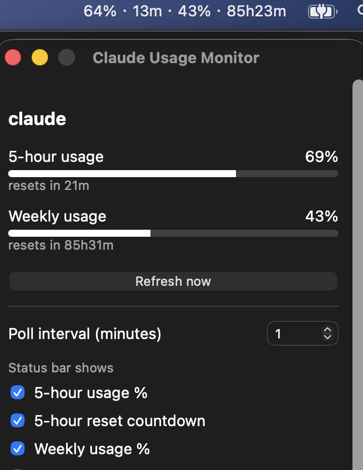

# Claude Usage Monitor

A macOS menu bar app for keeping an eye on your Claude Pro/Max subscription
usage — 5-hour and weekly rate-limit windows, each with a percentage used and
a reset time. Includes a status bar display and a macOS widget.

Built with extensibility in mind: usage data is normalized into a common
schema so support for other AI coding subscriptions (GitHub Copilot, Codex,
...) can be added later without changing the app itself.



## Why this exists, and its one real limitation

Anthropic doesn't publish an API for subscription usage. The only
ToS-compliant way to get this data is Claude Code's own `statusLine`
mechanism — see [`docs/data-source.md`](docs/data-source.md) for the full
explanation of why, and what was deliberately *not* done (scraping the
private `/api/oauth/usage` endpoint, which Anthropic explicitly prohibits for
third-party tools).

Practical consequence: the numbers you see reflect the last time Claude Code
rendered its status line, not a live query. If you haven't run Claude Code
recently, expect stale data until your next session.

Two things follow from this:

- **Small discrepancies vs. `claude /usage` are expected.** Since there's no
  live API, this app can only show what was captured at the last statusLine
  render — it won't always match `/usage` to the percentage point. This should
  narrow if Anthropic changes how usage data is exposed in the future, but
  there's no ETA for that.
- **Usage is shared with Claude chat/desktop**, so if you've been using those
  instead of Claude Code, the numbers here won't reflect that activity until
  Claude Code runs again. If the tray looks stale, send Claude Code any
  message (or hit "Refresh now" in the popover after) to force a fresh
  statusLine render.

## Install

1. Download the latest `.dmg` from [Releases](../../releases).
2. Open it and drag **Claude Usage Monitor** into `Applications`.
3. **First launch only:** this app isn't signed with an Apple Developer ID,
   so double-clicking it will show a warning ("Apple could not verify..."/
   "unidentified developer"). Instead, **right-click (or Control-click)
   the app in `Applications` and choose "Open"**, then confirm "Open" again
   in the dialog — this is a one-time step. If you already tried double-
   clicking and macOS says the app "is damaged", open **System Settings →
   Privacy & Security**, scroll down, and click **"Open Anyway"** next to
   the app's name, then confirm.
4. On first run, it offers to configure Claude Code's `statusLine` for
   you — accept, or do it manually following
   [`docs/setup-statusline.md`](docs/setup-statusline.md).
5. Use Claude Code at least once (send one message) so a `rate_limits`
   payload gets written. The tray icon updates on the next poll (default
   every minute).

## Features

- Status bar: shows 5-hour and weekly usage as a percentage or countdown to
  reset — configurable independently for each window.
- Click the tray icon for a small popover with both windows' progress and
  reset times.
- Configurable poll interval (how often the app re-reads the local usage
  snapshot; default 1 minute).
- macOS widget (Notification Center / desktop) mirroring the same data.

## Adding another provider (Copilot, Codex, ...)

See [`docs/usage-snapshot-schema.md`](docs/usage-snapshot-schema.md). In
short: write a collector script that emits the shared `UsageSnapshot` JSON
format for that provider; the app already reads every snapshot file in the
shared directory, so no app changes are needed.

## Development

Requires Rust (via [rustup](https://rustup.rs)), Node.js, and
[pnpm](https://pnpm.io).

```sh
pnpm install
pnpm tauri dev   # run in development
pnpm dist        # build .app and package a .dmg
```

The menu bar app and DMG packaging need nothing beyond the above. The
optional widget (see [`widget/README.md`](widget/README.md)) additionally
needs Xcode and `xcodegen`, plus a one-time step of picking your Apple ID
as the signing Team in Xcode — that part can't be done from the CLI.

For the full reinstall-and-verify checklist (clean state, build, install,
seed test data, walk every tray/window/popover behavior), see
[`docs/reinstall-testing-sop.md`](docs/reinstall-testing-sop.md).

## Versioning

Semantic Versioning — see [`CLAUDE.md`](CLAUDE.md#versioning) for the exact
rules, and [`CHANGELOG.md`](CHANGELOG.md) for release history.

## License

MIT — see [`LICENSE`](LICENSE).
